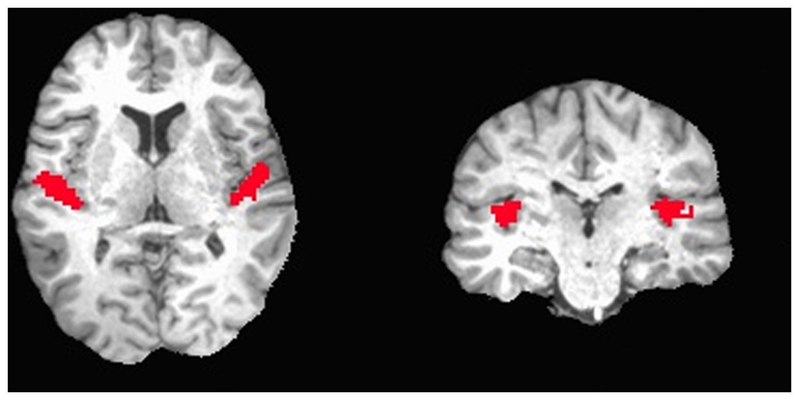

```{r setup, include=FALSE}
knitr::opts_chunk$set(echo = TRUE)
```

# Intro and setup

This notebook was originally developed for a short course for (graduate level) biostatisticians, as a short introduction to fMRI, as well as for cognitive neuroscientists with little to no knowledge of programming R.  As such, for both groups, some parts will be too easy, some will be rather hard, but this is a statistics workshop, so *on average*, everyone should learn something :-) 

## Data

The data for this workshop are the [CNP data (UCLA Consortium for Neuropsychiatric Phenomics LA5c Study) - revision 1.0.5](https://openfmri.org/dataset/ds000030/), available on openfmri with a PPDL license.
We will use the preprocessed data that is available on openfmri (preprocessed using [fmriprep](https://github.com/poldracklab/fmriprep)).  On github, there are 2 python scripts available (in the preparation directory) to extract time series from the data, in order to avoid overloading wifi and losing time to get the data during the tutorial.  Ideally, the instructor ran those scripts and provided the extracted time series for you.

# Working with fMRI data using R

## Recap: what is fMRI?

MRI is an imaging technique, with which we can take scans of muscles, bones, brains,... fMRI is when we repeatedly take MRI scans of the brain.  This allows us to see the brain _in action_ when it's performing tasks or in rest etc.

Imagine a subject listening to broadband noise for 15 seconds, and then listening to silence for 15 seconds, and repeat this for 10 times while taking brain scans every 3 seconds.  Afterwards, we can compare the scans during silence with the scans during music, and end up with an image like the following from [Okada et al., 2013](http://journals.plos.org/plosone/article?id=10.1371/journal.pone.0068959).  The brain image in the back is a structural MRI, the red blobs are the parts of the brain that show a significant difference between the two conditions.



In reality, the analysis of the data is much more complex than 'comparing images from two conditions' and there exist thousands of ways to analyse the data.  During this lesson, we will touch a few very basic methods, but a more thorough discussion is outside the scope.  We will assume that all the data is preprocessed, which means that:
- the data are corrected for motion
- the data are corrected for distortions
- the data from different subjects are aligned to a common template
- ...

## Reading and visualising fMRI data with R/neuroconductor.

After opening RStudio, we want to set our working directory to the directory we created during set up, where we can find the data:


```{r, eval=FALSE}
setwd("~/Desktop/validating-fmri/")
```

Neuroconductor is an open-source platform for analysing neuroimaging (and other) data.  It hosts multiple packages to analyse data using different software.  We will mostly use its  base library `neurobase`. To install, run:

```{r, eval=FALSE}
source("https://neuroconductor.org/neurocLite.R")
neuro_install("neurobase", release = "stable")
```

The data is located in the directory `data` in the working directory.  Now we can load the data into R using the function `readnii`.

```{r, message=FALSE}
library(neurobase)
data <- readnii("data/sub-10159/sub-10159_task-rest_bold_space-MNI152NLin2009cAsym_preproc.nii.gz")
```

The function `readnii` requires one argument: the name of the file we want to read.  This needs to be character string, which is why we put it in quotes.  We saved the data to the variable `sub70083`.  What comes out is an object of type `oro.nifti`.  Essentially, it is a 4D array, with extra metadata specific to fMRI data.  We can therefore apply functions that we can apply to `arrays`.  Let's look for example at the shape of our data.

```{r}
dim(data)
```

This shows us that the first three dimensions are `65 x 77 x 49`.  These correspond to the x-, y- and z-coordinates of the brain.  The fourth dimension is time, which means there are 152 time points measured.

We can also run a function from `neurobase` that only works on this type of object:

```{r}
check_nifti(data)
```

This shows some information that is stored in the "header" of the file.  For example, it tells us the pixel dimensions.  The first three numbers tell us the size of the voxels in space: 3 x 3 x 4 cm.  The last number tells us the dimension in time: a scan was taken every 2 seconds.

Another interesting function is the visualisation of nifti's.  Note that we only visualise one timepoint, the first one.  R will automatically show the first timepoint.

```{r}
orthographic(data)
```

If you're not sure about how to use a certain function, you can call for help:

```{r}
?orthographic
```

You will see that there are many more arguments that can be passed to the function `orthographic`.  For example the argument `xyz` allows us to specify where to draw the cross-hairs.  Let's try the following:

```{r}
orthographic(data,xyz=c(20,20,30))
```

To look at the `value` of one specific point in time and space, we can use indexes.  Remember our cross-hair in the figure was at the first timepoint at coordinates (20,20,30).  
The following example shows the exact value of this point in the figure at the first timepoint.

```{r}
data[20,20,30,1]
```

This shows that the value at the coordinates (20,20,30) at the first timepoint in the matrix os 1000.697.  The units of the data are a derivative of how much oxygen is in the blood, so in itself pretty meaningless.  Especially when you know that during preprocessing, the average is set to 1000.  What is more interesting is to look at how the value changes over time, which we can do by omitting the index in the 4th dimension:

```{r}
data[20,20,30,]
```

If we plot this vector, we can see how the measured signal in this voxel changes over time.

```{r}
plot(data[20,20,30,],type='l')
```

## Optional excercices

Now that we know how to read, inspect and visualise fMRI data, it's time for some exercises !
In the data-folder, there is for each subject 3 nifti-images:
- mask: sub-XXXXX_task-rest_bold_space-MNI152NLin2009cAsym_brainmask.nii.gz
- rest: sub-XXXXX_task-rest_bold_space-MNI152NLin2009cAsym_preproc.nii.gz
- anatomical: sub-XXXXX_T1w_preproc.nii.gz

We have looked at the functional rest data.  Now look at the anatomical scan yourself.
- Read in the anatomical data.
- What are the dimensions of the anatomical data?  Compare with the dimensions of the rest scan.
- Visualise the data.
- Set the color of the cross-hairs to `blue`
- Look at what the function `double_ortho` does, and use it to plot the rest scan (the first timepoint) and the anatomical scan.

# Resting state fMRI

## Recap: what is functional connectivity?

Before, we've worked with brain scans of subjects while they are performing specific tasks.  However, another field of research within neuroimaging is about what the brain does during rest.  It has been shown to be a valuable source to figure out how the brain is logically organised, and how the parts of the brain communicate with each other.

One interesting line of research is about creating atlases, where the brain is divided into different parts, for example using unsupervised learning (for example principle components analysis).  Another research is about finding the *'functional'* connections between those parts, for example by looking at the correlations between the average signal in those brain parcels.

### Extracting time series data

```{r, message=FALSE}
library(RColorBrewer)
library(scales)
library(lattice)
library(Rcmdr)
```

Let's look at the anatomical data for our first subject.

```{r}
sub10159_anat <- readnii("data/sub-10159/sub-10159_T1w_space-MNI152NLin2009cAsym_preproc_reduced.nii.gz")
ortho2(sub10159_anat)
```

And this is an atlas.  Note that this is not the original atlas, but a low-resolution version to work with in this course.  If you want the original atlas: https://team.inria.fr/parietal/18-2/spatial_patterns/spatial-patterns-in-resting-state/

```{r}
atlas <- readnii("data/MSDL_rois/msdl_rois_reduced_reshaped.nii")
ortho2(atlas)
```

With a few extra plotting functions using colorbrewer and the `scales` library, we can create a cool overlay of the atlas on the anatomical scan:

```{r}
rf <- colorRampPalette(rev(brewer.pal(11,'Spectral')))
cols <- rf(39)

ortho2(sub10159_anat,atlas,col.y=alpha(sample(cols),0.5))
```

Now we want to extract a certain brain region, for example BROCA from the resting state data.

```{r}
broca <- ifelse(atlas==29,1,0)
ortho2(sub10159_anat,broca,xyz=c(20,50,19))
```

Now we want to extract the average signal in this area:

```{r}
broca_mask <- array(rep(broca,152),dim=c(65,77,49,152))
broca_ts <- apply(data*broca_mask,4,sum)
plot(broca_ts,type='l')
```

Let's write a function to do this:

```{r}
extract_signal <- function(data,atlas,mask_id){
  mask <- ifelse(atlas==mask_id,1,0)
  expand_mask <- array(rep(mask,152),dim=c(65,77,49,152))
  data_masked <- data*expand_mask
  timeseries <- apply(data_masked,4,sum)
  timeseries <- (timeseries - mean(timeseries))/sd(timeseries)
  timeseries
}
```

```{r}
laud_ts <- extract_signal(data,atlas,1)
plot(laud_ts,type="l")
raud_ts <- extract_signal(data,atlas,2)
lines(raud_ts,col=2)
```

### Computing functional connectivity

```{r}
together = matrix(c(broca_ts,laud_ts,raud_ts),ncol=3)
correlations = cor(together)
levelplot(correlations)
estimate <- partial.cor(together,tests=TRUE)
levelplot(estimate$R)
```

```{r}
confounders <- read.table("data/sub-10159/sub-10159_task-rest_bold_confounds.tsv",skip=2)
fd <- confounders$V6
fd <- (fd-mean(fd))/sd(fd)
# there is no value for the fd on the first timepoint --> set to 0
fd <- c(0,fd)
plot(laud_ts,type="l")
lines(raud_ts,col=2)
lines(fd,col=3,lwd=3)
legend(-1.5,c("L Aud","R Aud","FD"),col=1:3,lty=1,cex=0.5)
```

## Optional exercises
* Can you extract the timeseries in subject 10365 for the different parts of the DMN. The atlas labels are: (4, Left DMN); (5, Median DMN); (6, Frontal DMN); (7, Right DMN)?
* Also try the following:
    + plot the time series together with the framewise displacement
    + what are the correlations
    + what happens if you add the motion to the time series when computing the partial correlations?

* Advanced:
    * Can you regress out the motion from the time series?
    * Can you regress out all motion parameters from the time series?
    * What happens with the correlations?
    * Can you extract (using a loop) the time series for all parts of the atlas?
    * Plot the correlation matrix and the partial correlation matrix.

# Validating fMRI as in Eklund (2017)

## The Eklund paper
Last year, Anders Eklund published a paper validating cluster inference.  He found that the false positive rate is sometimes **much** higher than the nominal level.  His really cool approach was to 'pretend' the resting state data is in fact coming from a task experiment with a random design matrix.  Given that the participants (and the experimentors) were unaware of the task, the null hypothesis should be true.

## Generate random designs using `neuRosim`

```{r, message=FALSE}
library(neuRosim)
```

Assume we are designing an fMRI experiment, with a blocked design (10 seconds on / 10 seconds off).  We can use `neuRosim` to create our design.

```{r}
totaltime <- 152*2
onsets <- seq(1,totaltime,40)
dur <- 20
s <- specifydesign(totaltime=totaltime,
                onsets=list(onsets),
                durations=dur,
                accuracy=1,
                effectsize=1,
                TR=2)
plot(s,type='l')
```

We could probably expect neurons to be firing very fast, but the signal that we measure is a **dependent** of the oxygen in the blood which comes only a few seconds later.  The signal that we expect looks like this:

```{r}
s <- specifydesign(totaltime=totaltime,
                onsets=list(onsets),
                durations=dur,
                accuracy=1,
                effectsize=1,
                TR=2,
                conv='double-gamma')
plot(s,type='l')
```

If we would now estimate whether a voxel is _significantly_ related to the task, we would regress the signal from a resting state dataset onto this design matrix. If we do that, we can assume the null hypothesis: any relation between the design and the signal is by chance.  

Ideally, we would now do this for all voxels, but for computational reasons, we'll focus on parcels (1000's of voxels vs 39 parcels).
Ideally, we would now extract the time series ourselves, but of or computational reasons, the time series are already extracted in the data folder (`CNP_ts/`).
Let's look at one subject.

```{r}
datdir <- 'data/CNP_ts/'
files <- list.files(datdir)
timeseries <- read.table(paste0(datdir,files[2]),sep=",")
head(timeseries,2)
```

```{r}
plot(timeseries$V1,type="l")
lines(s,col=2)
```

Now let's regress our data onto a random design.

```{r}
timeseries$design <- s
model <- lm("V1 ~ design",data=timeseries)
summary(model)
```

```{r}
summary(model)$coefficients
pval <- summary(model)$coefficients[2,4]
tval <- summary(model)$coefficients[2,3]
print(paste("pvalue: ",pval," - tvalue:",tval))
```

## Using this idea to validate fMRI analysis

Now we can loop this.

```{r}
pvals <- c()
tvals <- c()
i = 1
for (file in files){
  timeseries <- read.table(paste0(datdir,file),sep=",")
  timeseries$design <- s
  model <- lm("V1 ~ design",data=timeseries)
  pvals[i] <- summary(model)$coefficients[2,4]
  tvals[i] <- summary(model)$coefficients[2,3]
  i = i+1
}
sum(pvals<0.05)/length(pvals)
```

```{r}
hist(tvals,freq=FALSE,ylim=c(0,0.4))
x <- seq(-6,6,length=1000)
y <- dt(x,151)
lines(x,y)
```

## Taking into account temporal auto-correlations

### How to take into account the temporal auto-correlation

```{r}
create_white <- function(ntp,rho){
  V2 <- diag(ntp)
  V2 <- rho^abs(row(V2)-col(V2))
  W <- solve(V2^(1/2))
}
```

```{r}
W <- create_white(152,0.3)
timeseries$design_wh <- W%*% matrix(timeseries$design)
timeseries$V1_wh <- W %*% matrix(timeseries$V1)

model <- lm("V1_wh ~ design_wh",data=timeseries)
summary(model)
pval <- summary(model)$coefficients[2,4]
tval <- summary(model)$coefficients[2,3]
print(paste("pvalue: ",pval," - tvalue:",tval))
```

### Include this approach into our simulations

```{r}
pvals <- c()
tvals <- c()
i = 1
for (file in files){
  timeseries <- read.table(paste0(datdir,file),sep=",")
  timeseries$design <- s
  timeseries$design_wh <- W%*% matrix(timeseries$design)
  timeseries$V1_wh <- W %*% matrix(timeseries$V1)
  model <- lm("V1_wh ~ design_wh",data=timeseries)
  pvals[i] <- summary(model)$coefficients[2,4]
  tvals[i] <- summary(model)$coefficients[2,3]
  i = i+1
}
sum(pvals<0.05)/length(pvals)
```

```{r}
hist(tvals,freq=FALSE,ylim=c(0,0.4))
x <- seq(-6,6,length=1000)
y <- dt(x,151)
lines(x,y)
```

## Optional exercises
- What happens when you choose a more random design (onsets not evenly spaced)?
- What happens when you use a different autocorrelation value or function?
- Do you observe the same pattern in another?
- Can you make a loop (around the loop) that saves the false positive rate for all parcels.
- Advanced: in reality, we would want to estimate the autocorrelation from the data.  How would you approach this?
